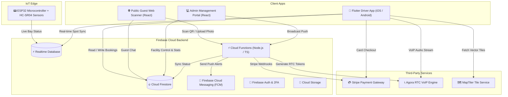

<div align="center">

# 🚗 myMove
### IoT Enabled Smart Parking Reservation and Privacy Vehicle Communication System

[](https://flutter.dev)
[](https://firebase.google.com)
[](https://react.dev)
[](https://www.typescriptlang.org)
[](https://www.espressif.com)
[](https://stripe.com)
[](https://www.agora.io)

<p align="center">
  <b>An end-to-end smart parking ecosystem combining IoT ultrasonic occupancy sensors, interactive map navigation, instant Stripe payments, digital QR vehicle passes, and real-time VoIP/chat driver obstruction resolution.</b>
</p>

</div>

---

## 📌 Table of Contents

- [Overview](#-overview)
- [Key Features](#-key-features)
- [System Architecture](#-system-architecture)
- [Project Components](#-project-components)
- [Technology Stack](#-technology-stack)
- [Repository Structure](#-repository-structure)
- [Getting Started](#-getting-started)
  - [Prerequisites](#prerequisites)
  - [1. Mobile Application (Flutter)](#1-mobile-application-flutter)
  - [2. IoT Hardware (ESP32)](#2-iot-hardware-esp32)
  - [3. Backend & Cloud Functions](#3-backend--cloud-functions)
  - [4. Admin Web & Scanner Web](#4-admin-web--scanner-web)
- [Security & Environment Setup](#-security--environment-setup)
- [Authors & Acknowledgments](#-authors--acknowledgments)

---

## 📖 Overview

Urban parking congestion and unauthorized double-parking are major pain points in metropolitan areas. **myMove** delivers a unified smart parking solution that bridges the physical and digital worlds:

1. **Eliminates Parking Cruising:** Real-time bay occupancy detection through ESP32 ultrasonic sensors and map-based parking spot reservations.
2. **Solves Double-Parking Obstructions:** Digital QR windshield passes allow blocked drivers—or non-app guests via a public web scanner—to immediately contact vehicle owners via push alerts, live chat, or private VoIP calls.
3. **Automated Parking Operations:** Server-side Stripe payment confirmation, automated 10-minute expiry notifications, and a comprehensive React management dashboard.

---

## ✨ Key Features

### 📱 1. Mobile Driver Application (Flutter)
- **Interactive Map & Navigation:** Browse nearby parking facilities using MapLibre vector maps with real-time location tracking and distance calculation.
- **Live IoT Spot Grid:** View real-time spot availability (`Available`, `Occupied`, `Reserved`) synchronized directly with physical ESP32 sensors.
- **Reservation & Dynamic Booking:** Select reservation durations, apply rates, and manage active parking sessions with countdown timers and instant extensions.
- **Stripe In-App Payments:** Frictionless checkout with Stripe Payment Intents and webhook-verified confirmation.
- **Digital Vehicle QR Pass:** Personalized in-app vehicle QR pass to display on windshields for fast contact.
- **In-App Messaging & Agora VoIP Calling:** Real-time driver-to-driver chat and low-latency voice calling powered by Agora RTC.
- **Emergency SOS Mode:** One-tap emergency dispatch alert sent directly to building management with location data.
- **Two-Factor Authentication (2FA):** Industry-standard TOTP authenticator integration (Google Authenticator / Duo) and email OTP fallback.

### 🌐 2. App-less Guest Scanner Portal (`scanner-web`)
- **Zero App Installation Needed:** Any blocked driver can scan a vehicle's windshield QR code with a standard smartphone camera.
- **Photo Proof & Geolocation Capture:** Uploads photo proof of obstruction and logs GPS coordinates to prevent false alerts.
- **Direct Notification Dispatch:** Automatically triggers high-priority Firebase push notifications to the car owner.
- **Ephemeral Web Chat:** Enables real-time web-to-app communication between the guest and the vehicle owner.

### 📊 3. Facility Management Admin Dashboard (`admin-web`)
- **Live Spot Management:** Visual grid of parking bays with manual override capabilities and status toggling.
- **Revenue & Analytics:** Real-time financial summaries, booking volume charts, and peak utilization trends.
- **Emergency Dispatch Center:** Incoming SOS alerts feed with live audio dispatch integration and resolution tracking.
- **Global Broadcast Push Alerts:** Broadcast announcements and maintenance alerts to all registered app users.

### ⚡ 4. IoT Smart Sensor Node (`esp32_smart_parking`)
- **Edge Distance Detection:** Multi-sensor HC-SR04 ultrasonic array monitoring physical parking bays.
- **Direct Firebase Synchronization:** Delta-triggered updates sent to Firebase Realtime Database (RTDB) to minimize network overhead and latency.

### ☁️ 5. Serverless Backend (`functions`)
- **Stripe Webhooks:** Atomic Firestore transaction processing on payment confirmation (`payment_intent.succeeded`).
- **Dynamic VoIP Token Generation:** Server-side generation of privileged RTC connection tokens for secure calling.
- **Cron Expiry Monitor:** Scheduled Cloud Function running every minute to alert drivers 10 minutes prior to session expiration.

---

## 🏗️ System Architecture



---

## 🧰 Technology Stack

| Domain | Technology | Purpose |
| :--- | :--- | :--- |
| **Mobile App** | [Flutter](https://flutter.dev) (Dart) | Cross-platform mobile driver app (Android & iOS) |
| **State Management** | [Provider](https://pub.dev/packages/provider) | Reactive state and business logic separation |
| **Map & Geospatial** | [MapLibre GL](https://maplibre.org) / MapTiler | High-performance vector tile rendering & navigation |
| **VoIP Calling** | [Agora RTC SDK](https://www.agora.io) | Low-latency in-app audio voice calling |
| **Payments** | [Stripe SDK](https://stripe.com) | Mobile payment sheet & server-side webhook reconciliation |
| **Web Applications** | [React 18](https://react.dev) + [Vite](https://vitejs.dev) + [TypeScript](https://www.typescriptlang.org) | Admin Dashboard & Public Guest Web Scanner |
| **Web Styling** | [Tailwind CSS](https://tailwindcss.com) + [Lucide Icons](https://lucide.dev) | Modern responsive UI & analytics visualization |
| **Cloud Backend** | [Firebase](https://firebase.google.com) (Firestore, RTDB, Auth, Storage, FCM) | Serverless backend-as-a-service infrastructure |
| **Serverless Logic** | [Cloud Functions](https://firebase.google.com/docs/functions) (Node.js / TypeScript) | Webhooks, scheduled jobs, Agora token generator |
| **IoT Hardware** | [ESP32 NodeMCU](https://www.espressif.com) + HC-SR04 | Ultrasonic distance edge sensing & telemetry |

---

## 📂 Repository Structure

```text
mymove/
├── admin-web/              # React + Vite Admin & Facility Operations Portal
│   ├── src/pages/          # Dashboard, Spot Management, Emergency & Broadcast
│   └── src/firebase.ts     # Firebase Web Client Configuration
│
├── scanner-web/            # Public Guest Web QR Scanner (App-less)
│   ├── src/App.tsx         # Camera scan, photo evidence upload, move request
│   └── src/Chat.tsx        # Real-time web-to-app driver chat interface
│
├── lib/                    # Flutter Driver Application Source Code
│   ├── config/             # Agora config, routes, theme & constants
│   ├── models/             # Booking, Parking Spot, User, Message models
│   ├── providers/          # Auth, Booking, Parking, Theme providers
│   ├── screens/
│   │   ├── auth/           # Login, Register, 2FA & OTP verification
│   │   ├── booking/        # Spot booking, duration picker, active timers
│   │   ├── calling/        # In-app Agora VoIP voice calling screens
│   │   ├── chat/           # Real-time driver-to-driver messaging
│   │   ├── home/           # MapLibre map, location search, SOS modal
│   │   ├── landmark/       # Building detail cards & checkout screen
│   │   ├── parking/        # Live IoT parking spot grid
│   │   └── qr/             # Digital vehicle QR display & camera scanner
│   ├── services/           # Firebase, Stripe, FCM & Notification services
│   └── widgets/            # Reusable UI components & parking timers
│
├── functions/              # Firebase Cloud Functions (TypeScript)
│   ├── src/index.ts        # Stripe Webhook, Agora token builder, Expiry cron
│   └── package.json        # Cloud Functions dependencies
│
├── esp32_smart_parking/    # IoT Microcontroller Firmware (Arduino C++)
│   ├── esp32_smart_parking.ino   # Sensor distance polling & Firebase sync
│   ├── PINOUT.md                 # Hardware wiring diagram & GPIO mappings
│   └── secrets.example.h         # Template for Wi-Fi & Firebase credentials
│
├── assets/                 # Icons, brand logos, custom fonts
├── documentation/          # System design, architecture diagrams, charts
└── firestore.rules         # Declarative Firestore security rules
```

---

## 🚀 Getting Started

### Prerequisites
- [Flutter SDK](https://docs.flutter.dev/get-started/install) (`>=3.0.0`)
- [Node.js](https://nodejs.org) (`>=18.x`) & `npm`
- [Arduino IDE](https://www.arduino.cc/en/software) or [PlatformIO](https://platformio.org) (for ESP32)
- [Firebase CLI](https://firebase.google.com/docs/cli) (`npm install -g firebase-tools`)

---

### 1. Backend & Cloud Functions (`functions`)

1. Navigate to the functions directory and install dependencies:
   ```bash
   cd functions
   npm install
   ```
2. Create your local environment file:
   ```bash
   cp .env.example .env
   ```
3. Populate `functions/.env` with your active keys:
   ```env
   STRIPE_SECRET_KEY=sk_test_your_stripe_secret_key
   STRIPE_WEBHOOK_SECRET=whsec_your_webhook_signing_secret
   AGORA_APP_ID=your_agora_app_id
   AGORA_APP_CERTIFICATE=your_agora_primary_certificate
   ```
4. Deploy Cloud Functions and Security Rules:
   ```bash
   firebase deploy --only functions,firestore:rules,storage:rules
   ```

---

### 2. Admin Web Dashboard (`admin-web`)

1. Navigate to the `admin-web` directory and install dependencies:
   ```bash
   cd admin-web
   npm install
   ```
2. Create your local environment file:
   ```bash
   cp .env.example .env
   ```
3. Configure `admin-web/.env` with your Agora and Firebase web client credentials:
   ```env
   VITE_AGORA_APP_ID=your_agora_app_id
   VITE_FIREBASE_API_KEY=your_firebase_api_key
   VITE_FIREBASE_AUTH_DOMAIN=your-project.firebaseapp.com
   VITE_FIREBASE_PROJECT_ID=your-project-id
   VITE_FIREBASE_STORAGE_BUCKET=your-project.firebasestorage.app
   VITE_FIREBASE_MESSAGING_SENDER_ID=your_sender_id
   VITE_FIREBASE_APP_ID=your_web_app_id
   VITE_FIREBASE_DATABASE_URL=https://your-project-default-rtdb.asia-southeast1.firebasedatabase.app
   ```
4. Start the development server:
   ```bash
   npm run dev
   ```

---

### 3. Guest Scanner Web Portal (`scanner-web`)

1. Navigate to the `scanner-web` directory and install dependencies:
   ```bash
   cd scanner-web
   npm install
   ```
2. Create your local environment file:
   ```bash
   cp .env.example .env
   ```
3. Configure `scanner-web/.env` with your Firebase web client credentials:
   ```env
   VITE_FIREBASE_API_KEY=your_firebase_api_key
   VITE_FIREBASE_AUTH_DOMAIN=your-project.firebaseapp.com
   VITE_FIREBASE_PROJECT_ID=your-project-id
   VITE_FIREBASE_STORAGE_BUCKET=your-project.firebasestorage.app
   VITE_FIREBASE_MESSAGING_SENDER_ID=your_sender_id
   VITE_FIREBASE_APP_ID=your_web_app_id
   VITE_FIREBASE_DATABASE_URL=https://your-project-default-rtdb.asia-southeast1.firebasedatabase.app
   ```
4. Start the development server:
   ```bash
   npm run dev
   ```

---

### 4. Mobile Application (Flutter)

1. Navigate to the project root and install Flutter dependencies:
   ```bash
   flutter pub get
   ```
2. Configure local templates:
   * **MapTiler Map Config:** Copy `lib/config/map_config.example.dart` to `lib/config/map_config.dart` and insert your MapTiler API key.
   * **Agora VoIP Config:** Copy `lib/config/agora_config.example.dart` to `lib/config/agora_config.dart` and insert your Agora App ID.
   * **EmailJS Keys:** Copy `lib/services/email_keys.dart.example` to `lib/services/email_keys.dart` and insert your EmailJS service credentials.
   * **Firebase Options:** Copy `lib/firebase_options.example.dart` to `lib/firebase_options.dart` (or run `flutterfire configure`).
   * Place `google-services.json` in `android/app/` and `GoogleService-Info.plist` in `ios/Runner/`.
3. Launch the app on a physical device or emulator:
   ```bash
   flutter run
   ```

---

### 5. IoT Hardware (ESP32)

1. Open `esp32_smart_parking/esp32_smart_parking.ino` in the Arduino IDE.
2. Install the **Firebase ESP Client** library (`Firebase_ESP_Client` by Mobizt).
3. Copy `esp32_smart_parking/secrets.example.h` to `esp32_smart_parking/secrets.h`:
   ```cpp
   #define WIFI_SSID "YOUR_WIFI_SSID"
   #define WIFI_PASSWORD "YOUR_WIFI_PASSWORD"
   #define DATABASE_SECRET "YOUR_FIREBASE_DATABASE_SECRET"
   #define DATABASE_URL "https://YOUR_PROJECT-default-rtdb.asia-southeast1.firebasedatabase.app"
   ```
4. Wire your HC-SR04 ultrasonic sensors according to [PINOUT.md](esp32_smart_parking/PINOUT.md).
5. Select **ESP32 Dev Module** and flash the firmware.

---

## 🔐 Security & Environment Setup
> ### 🛡️ Security Disclaimer & Secret Invalidation Notice
> To keep the full commit and branch history of this university and portfolio project, some old commits may contain test keys used during development. All API keys, certificates, webhooks, and tokens from previous commits, including Stripe, Agora, MapTiler, and Firebase, have been revoked and replaced. The current code on main uses environment variables and local files protected by `.gitignore` to store configuration and sensitive information.

When configuring or deploying **myMove**, ensure that sensitive credentials are kept secure:

* **Stripe Keys:** Use restricted API keys in production and verify webhook signatures via `STRIPE_WEBHOOK_SECRET`.
* **Agora Credentials:** Keep the Agora `appCertificate` strictly on the server (Cloud Functions) and issue ephemeral RTC tokens with short expiration times.
* **Firestore & Storage Rules:** Apply declarative rules ([firestore.rules](firestore.rules)) to enforce user authentication and document ownership across all collections.
* **Git Hygiene:** Never commit `secrets.h`, `.env`, `serviceAccountKey.json`, or production `google-services.json` files. Standard `.example` configuration files are provided across all submodules.

---

## 👨‍💻 Authors & Acknowledgments

* **Saabiresh** ([@YoungCarti](https://github.com/YoungCarti)) - *Developer*
* Developed as part of the Final Year Project (FYP) under the School of Computing & Digital Technology at **University Malaysia of Computer Science & Engineering (UNIMY)**.
