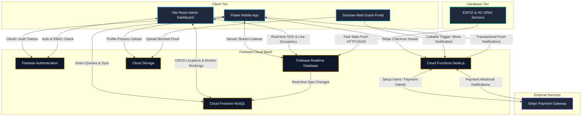
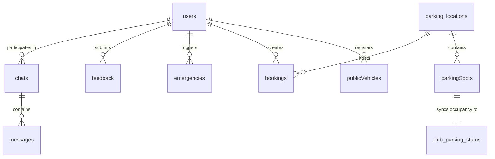

# 🖥️ System Development: 4.6 Backend Implementation & 4.7 Database Design

This document contains the complete, ready-to-use content for **Section 4.6 (Backend Implementation)**, **Section 4.7 (Database Design)**, and **Section 4.8 (Summary)** of your thesis report. It is written in a professional, academic style, matching the structure and technical depth of the reference thesis pages 48–50, customized specifically for the `myMove` platform.

---

## 4.6 Backend Implementation

### 4.6.1 Backend Architecture
The `myMove` smart parking application utilizes a serverless **Backend-as-a-Service (BaaS)** architecture powered by Google Firebase. This approach eliminates the maintenance overhead of managing a dedicated physical or virtual application server. Instead, both the mobile client (Flutter) and the administrative web portals (React/Vite) communicate directly and securely with Firebase's cloud services using authenticated SDKs. 

This architecture guarantees sub-second responsiveness for real-time sensor updates, simplifies user credential management, and provides automated horizontal scaling capable of supporting hundreds of concurrent drivers and administrators.



The system is decomposed into four core operational blocks:

1. **Client Tier**:
   * **Flutter Mobile App**: Written in Dart, serving as the user interface for drivers. It accesses Firebase services via the official `firebase_core`, `firebase_auth`, `cloud_firestore`, `firebase_database`, and `firebase_messaging` plugins.
   * **React Web Admin Dashboard**: A responsive administration tool built with React and Vite. It allows managers to audit reports, view revenue analytics, manage locations, and monitor active SOS situations.
   * **Scanner-Web Portal**: A lightweight React-based web interface designed for guests. When a guest scans the QR code affixed to a vehicle blocking their path, this site opens instantly without requiring an app store download.

2. **Firebase Cloud BaaS**:
   * **Authentication**: Manages registration and sign-in using secure JSON Web Tokens (JWT). It supports standard email/password authentication, linking physical phone numbers, and coordinates session persistence.
   * **Cloud Firestore**: A flexible, document-oriented NoSQL database that houses all persistent relational data (e.g., profiles, booking ledgers, active chat sessions, locations).
   * **Firebase Realtime Database (RTDB)**: A low-latency, WebSocket-based JSON database. It is optimized to stream the binary state (`available` or `occupied`) of physical parking spots from hardware microcontrollers straight to connected clients within milliseconds.
   * **Cloud Storage**: Serves as a secure object store for binary assets, handling driver verification photos for blocked move requests and user-uploaded profile pictures.
   * **Cloud Functions**: A serverless Node.js backend executing secure operations that cannot be trusted to client code (e.g., Stripe Payment Intent signing, rate-limiting guest requests, and validating active booking overlaps).

3. **Hardware Tier (IoT Subsystem)**:
   * **ESP32 Microcontroller**: Wired to ultrasonic distance sensors (HC-SR04) monitoring physical slots. It runs firmware that computes parking slot occupancy and pushes status changes directly to the Firebase Realtime Database path.

4. **External Infrastructure**:
   * **Stripe Payment Gateway**: Handles payment card entry and processing. The client requests a secure session through Cloud Functions, which returns a setup intent token allowing the Stripe Flutter SDK to securely present a payment form, eliminating local database compliance risks.

---

## 4.7 Database Design

The database design utilizes a hybrid model combining **Cloud Firestore** for structured, relational, and persistent collections and **Firebase Realtime Database (RTDB)** for rapid-fire hardware sensor occupancy streaming. Since Firestore is a document-oriented database, tables are represented as *collections*, and rows are represented as *documents*. Cross-collection relationships are modeled through the nesting of unique identifiers (foreign keys) inside documents. 

Data isolation and security are enforced directly at the database engine level via **Firestore Security Rules**, preventing unauthorized clients from reading or modifying confidential information.



### 4.7.1 Cloud Firestore Collections Schema

The persistent data schema is composed of the following primary collections:

#### 1. `users` Collection
Stores user account profiles, roles, push notification tokens, and cryptographic keys required for Multi-Factor Authentication.

| Field Name | Data Type | Description |
| :--- | :--- | :--- |
| `uid` (Document ID) | String | Unique identifier linked to Firebase Auth. |
| `displayName` | String | User's full name. |
| `email` | String | Registered email address. |
| `role` | String | System access tier: `user` or `admin`. |
| `twoFactorSecret` | String | Base32 cryptographic secret key for Google Authenticator TOTP. |
| `isTwoFactorEnabled` | Boolean | True if Two-Factor Authentication is active. |
| `fcmToken` | String | Firebase Cloud Messaging token for push notifications. |
| `vehicles` | Array (Map) | Nested list of user vehicles: `[{brand, model, plateNumber, isPrimary}]`. |
| `createdAt` | Timestamp | Timestamp indicating account registration date. |

#### 2. `publicVehicles` Collection
A public registry of vehicles mapping license plates and brands to their registered owner IDs, enabling instant QR resolution.

| Field Name | Data Type | Description |
| :--- | :--- | :--- |
| `vehicleId` (Document ID) | String | Matches the registered owner's UID. |
| `ownerId` | String | References the `users` UID. |
| `plateNumber` | String | License plate number (indexed for fast search). |
| `brand` | String | Vehicle manufacturer brand. |
| `model` | String | Specific vehicle model name. |
| `color` | String | Vehicle color description. |
| `isActive` | Boolean | Active flag indicating if the vehicle is currently in use. |
| `createdAt` | Timestamp | Registration timestamp. |

#### 3. `parking_locations` Collection
Contains structural information and pricing rates for active parking facility buildings.

| Field Name | Data Type | Description |
| :--- | :--- | :--- |
| `locationId` (Document ID) | String | Unique parking location identifier. |
| `name` | String | Human-readable building name (e.g. "Main Block"). |
| `address` | String | Full physical street address. |
| `latitude` | Number | GPS latitude coordinate. |
| `longitude` | Number | GPS longitude coordinate. |
| `hourlyRate` | Number | Cost per hour of parking (in MYR). |
| `operatingHours` | String | Opening and closing rules (e.g. "08:00 - 22:00"). |

#### 4. `parkingSpots` Collection
Maps user-facing layout spots to physical hardware sensor units.

| Field Name | Data Type | Description |
| :--- | :--- | :--- |
| `spotId` (Document ID) | String | Composite key combining location and spot name. |
| `locationId` | String | Foreign Key referencing `parking_locations.locationId`. |
| `spotName` | String | User display code (e.g., "A1", "A2"). |
| `hardwareSensorId` | String | Unique hardware sensor ID printed on the physical sensor. |
| `createdAt` | Timestamp | Creation date of mapping. |

#### 5. `bookings` Collection
The transaction ledger documenting parking spot reservations, duration boundaries, payment details, and status logs.

| Field Name | Data Type | Description |
| :--- | :--- | :--- |
| `bookingId` (Document ID) | String | Cryptographically generated transaction ID. |
| `userId` | String | Foreign Key referencing the driver's `users.uid`. |
| `locationId` | String | Foreign Key referencing `parking_locations.locationId`. |
| `spotName` | String | The reserved parking spot code. |
| `startDateTime` | String (ISO) | Reservation start boundary. |
| `endDateTime` | String (ISO) | Reservation expiration boundary. |
| `status` | String | Booking status: `pending`, `active`, `completed`, `canceled`. |
| `totalPrice` | Number | Initial calculated rate. |
| `totalPaid` | Number | Final actual payment captured (with Stripe processing fees). |
| `paymentIntentId` | String | Reference ID mapping to the payment in the Stripe Dashboard. |
| `createdAt` | Timestamp | Creation timestamp. |

#### 6. `chats` and `messages` Collections
Handles real-time session dialogues between blocked reporters and vehicle owners. Messages are organized as a subcollection under each specific chat document.

**Collection: `chats`**
| Field Name | Data Type | Description |
| :--- | :--- | :--- |
| `chatId` (Document ID) | String | Composite participant key: `[reporterUid]_[ownerUid]`. |
| `participants` | Array (String) | List containing both active user UIDs. |
| `lastMessage` | String | Content snippet of the most recent message. |
| `lastMessageAt` | Timestamp | Timestamp indicating when the last message was sent. |
| `blockedDriverId` | String | UID of the driver whose car is blocked. |
| `vehicleOwnerId` | String | UID of the driver blocking the path. |

**Subcollection: `chats/{chatId}/messages`**
| Field Name | Data Type | Description |
| :--- | :--- | :--- |
| `messageId` (Document ID) | String | Unique message ID. |
| `senderId` | String | UID of the message sender. |
| `receiverId` | String | UID of the message receiver. |
| `messageText` | String | Decrypted message content. |
| `isRead` | Boolean | True if the receiver has viewed the message. |
| `createdAt` | Timestamp | Timestamp representing exact delivery time. |

#### 7. `emergencies` Collection
Central emergency dashboard queue tracking panic alerts triggered by mobile users.

| Field Name | Data Type | Description |
| :--- | :--- | :--- |
| `emergencyId` (Document ID) | String | Unique alert ID. |
| `userId` | String | Foreign Key referencing the reporting `users.uid`. |
| `locationAddress` | String | Nearest street name fetched via geolocation APIs. |
| `latitude` | Number | Exact trigger latitude. |
| `longitude` | Number | Exact trigger longitude. |
| `status` | String | Management status: `active` or `resolved`. |
| `createdAt` | Timestamp | Timestamp of alert trigger. |

#### 8. `feedback` Collection
Collects user acceptance feedback scores and textual evaluations during testing phases.

| Field Name | Data Type | Description |
| :--- | :--- | :--- |
| `feedbackId` (Document ID) | String | Unique feedback ID. |
| `userId` | String | Foreign Key referencing `users.uid`. |
| `score` | Number | Satisfaction rating from 1 to 5. |
| `comments` | String | Open-ended user remarks. |
| `createdAt` | Timestamp | Submission timestamp. |

---

### 4.7.2 Firebase Realtime Database (RTDB) Schema

The Realtime Database uses an optimized, schema-less JSON tree designed for rapid reading and writing by low-power IoT microcontrollers. The state is nested under the location and spot keys to minimize data payload sizes:

```json
{
  "parking_status": {
    "location_A": {
      "slot_1": "occupied",
      "slot_2": "available",
      "slot_3": "occupied"
    },
    "location_B": {
      "slot_1": "available",
      "slot_2": "available"
    }
  }
}
```

* **Data Path**: `/parking_status/{locationId}/{spotName}`
* **Payload values**: 
  * `"available"`: Ultrasonic distance measurement exceeds the threshold (> 10.0 cm), indicating the spot is vacant.
  * `"occupied"`: Distance measurement is within the threshold (≤ 10.0 cm), indicating a vehicle is present.

This status is updated instantly by ESP32 microcontrollers using simple HTTP `PATCH` requests, triggering immediate stream listener events in user mobile apps.

---

## 4.8 Chapter Summary

Chapter 4 detailed the complete engineering execution of the `myMove` smart parking application. The project incorporates a Flutter mobile app for driver interactions, React-based web portals for administration and lightweight guest interactions, and an ESP32-based hardware subsystem for real-time occupancy monitoring. 

By leveraging Firebase Backend-as-a-Service, the platform integrates real-time database updates, secure Stripe payments, rate-limited cloud messaging, and robust multi-factor security mechanisms. The next chapter will focus on evaluating the performance, usability, and correctness of these integrated modules through extensive testing phases.
