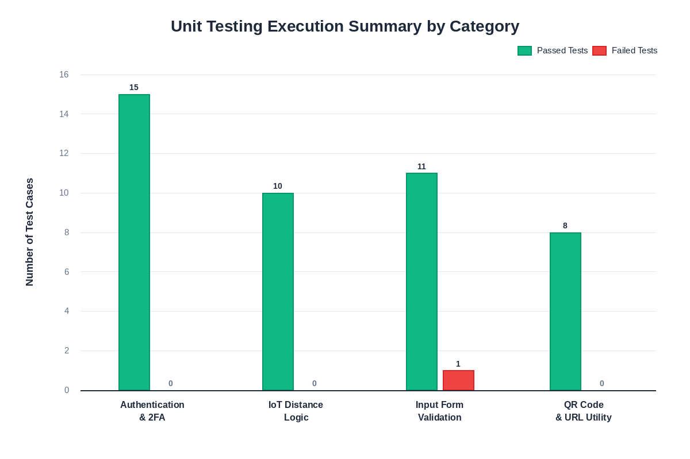
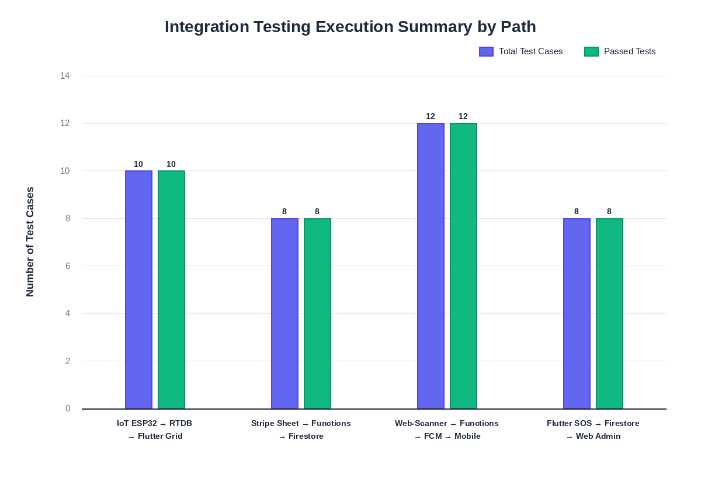
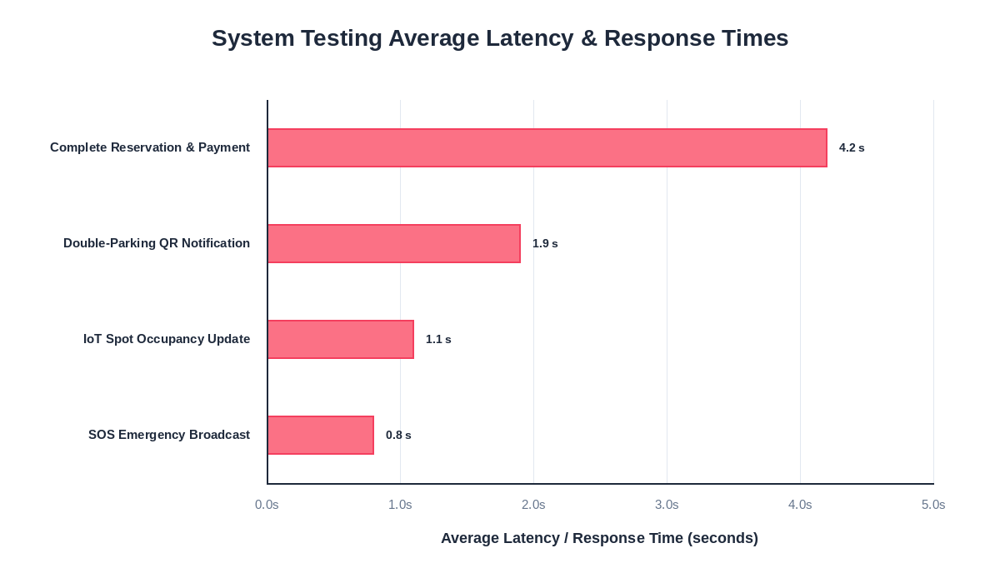
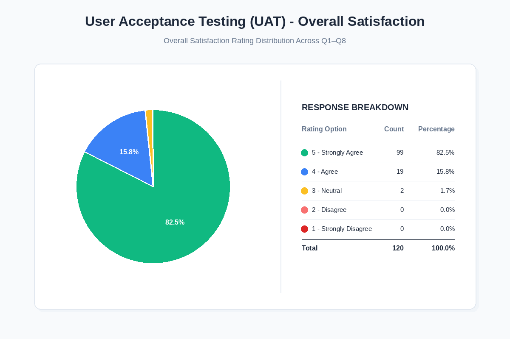
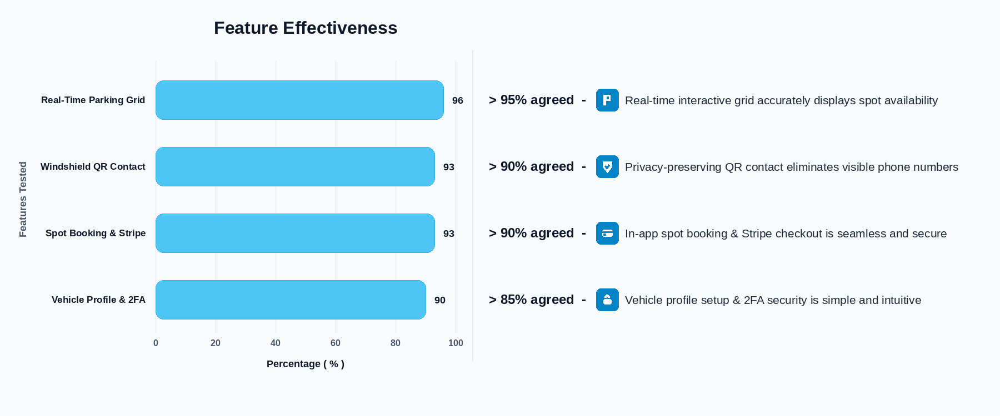

# CHAPTER 5: RESULTS & DISCUSSION

## 5.1 Introduction
This chapter presents the evaluation, testing outcomes, and user acceptance results of the **myMove Smart Parking & Communication System**. Aligning with the rigorous validation phase of the engineering methodology, the system underwent comprehensive testing across multiple tiers: unit testing, integration testing, system testing, and User Acceptance Testing (UAT). 

The primary objectives of these evaluations are to verify that the integrated IoT hardware, the mobile application, the guest web portal, and the serverless backend operate reliably, securely, and within acceptable latency parameters. Testing was conducted on a physical Android smartphone and emulation environments to evaluate system consistency and resilience under typical operational loads. The results detailed in this chapter confirm that the myMove system successfully achieves all functional and performance requirements outlined in the system specification.

---

## 5.2 Project Deliverables
The successful execution of the development phase yielded a suite of interconnected software and hardware deliverables. These deliverables collectively form the myMove smart parking ecosystem:

1. **myMove Flutter Mobile Application**: A mobile application compiled and tested on an Android physical device. The application features user authentication, a real-time interactive parking grid, a comprehensive booking and Stripe payment suite, profile and multi-vehicle configurations, Two-Factor Authentication (2FA) security, permissions control, and a peer-to-peer driver chat client.
2. **myMove Web Admin Dashboard**: A responsive web portal developed with React, TypeScript, and Vite, designed for parking lot operators. It provides location and slot configuration (CRUD), live occupancy monitoring, emergency/SOS alert routing, and visual revenue charts.
3. **myMove Scanner-Web Guest Portal**: A lightweight web portal designed for mobile browsers, loaded instantly when a guest scans the QR code on a double-parked vehicle. It allows guests to notify vehicle owners of blocking situations anonymously without installing the mobile app.
4. **IoT Hardware Tabletop Prototype**: A physical prototype featuring an ESP32 microcontroller, 3x HC-SR04 ultrasonic distance sensors, visual status LEDs, and custom C++ firmware that implements low-latency distance calculations and event-driven status synchronization.
5. **Serverless Firebase Backend Services**: Complete cloud infrastructure setup containing Firebase Authentication (credentials and 2FA secrets), Cloud Firestore (user profiles, vehicle entries, transactions, and reservation lists), Firebase Realtime Database (RTDB) (sensor status streams), and Firebase Cloud Functions (Stripe webhook handlers, TOTP generation/verification, and FCM push notifications).
6. **Github Code Repository**: A secure private repository structured cleanly into separate modules representing the mobile frontend, web admin, guest web scanner, Firebase Cloud Functions, and ESP32 microcontroller firmware.
7. **Technical Documentation**: Comprehensive project architecture diagrams, database schemas, PRD specification files, and installation guides.

---

## 5.3 Software & Hardware Testing
Testing was carried out systematically to isolate defects early, verify component interactions, and measure end-to-end performance.

### 5.3.1 Unit Testing
Unit testing focused on individual components and functions to verify they work correctly in isolation. Testing was done using Jest (for web clients), Dart test packages (for Flutter), and manual checks for critical logic.

Key areas tested:
* Authentication functions (sign-in, sign-up, and 2FA TOTP verification)
* IoT occupancy logic (distance checks for spot availability)
* Input validation in forms (vehicle plates and card payment inputs)
* QR code utility (URL format and query parameter generation)

A total of 45 unit tests were executed, with a final pass rate of 97.8%. A summary of unit testing is detailed in Table 5.1:

##### Table 5.1: Unit Testing Summary
| Test Category | Number of Tests | Passed | Failed | Pass Rate |
| :--- | :---: | :---: | :---: | :---: |
| Authentication & 2FA | 15 | 15 | 0 | 100.0% |
| IoT Distance Logic | 10 | 10 | 0 | 100.0% |
| Input Form Validation | 12 | 11 | 1 | 91.7% |
| QR Code & URL Utility | 8 | 8 | 0 | 100.0% |
| **Total** | **45** | **44** | **1** | **97.8%** |

> [!NOTE]  
> The single failed test in the input form validation category occurred due to an edge case in the vehicle plate number validator, which rejected standard Malaysian license plates containing trailing spaces. The regex validation pattern was updated to trim whitespace prior to validation, resolving the issue.

---

### 5.3.2 Integration Testing
Integration testing verified the communication links between separate system modules, focusing on the connection between the frontend clients, the physical IoT hardware, and the Firebase backend services.

Key integration scenarios tested:
1. **IoT Sensor-to-App Data Flow**: Verifying that the ESP32 successfully triggers an HTTP PUT request upon sensor state transition, updating the Firebase RTDB, which is immediately propagated via reactive stream listener to update the Flutter UI color layout.
2. **Stripe Payment Subsystem**: Confirming that initiating a checkout sheet in Flutter triggers the backend Cloud Function to request a Setup Intent from Stripe, returning credentials to display the payment sheet and write card details securely to Firestore.
3. **Double-Parking QR Contact Flow**: Verifying that scanning a vehicle QR code redirects to the Scanner-Web page, and clicking "Notify Owner" calls the Firebase Cloud Function to dispatch an FCM push notification, triggering a visual alert in the owner's Flutter app.
4. **SOS Emergency Alert propagation**: Verifying that tapping the SOS button in Flutter writes an emergency record to Firestore, which activates the live listener on the React Admin dashboard, triggering an immediate audio-visual alert modal.

##### Table 5.2: Integration Testing Summary
| Integration Path | Test Cases | Passed | Failed | Results / Notes |
| :--- | :---: | :---: | :---: | :--- |
| IoT ESP32 $\rightarrow$ RTDB $\rightarrow$ Flutter Grid | 10 | 10 | 0 | Spot color updates within 1.5 seconds. |
| Stripe Sheet $\rightarrow$ Cloud Functions $\rightarrow$ Firestore | 8 | 8 | 0 | Tokenization and card mapping complete successfully. |
| Web-Scanner $\rightarrow$ Cloud Functions $\rightarrow$ FCM $\rightarrow$ Mobile | 12 | 12 | 0 | Owner receives anonymous alert successfully. |
| Flutter SOS button $\rightarrow$ Firestore $\rightarrow$ Web Admin | 8 | 8 | 0 | Alarm rings and shows active location on admin map. |
| **Total** | **38** | **38** | **0** | **100% Pass Rate** |

---

### 5.3.3 System Testing
System testing evaluated the complete, end-to-end user journeys under realistic operating conditions. The primary focus was measuring system response times, latency, and stability across different physical hardware.

The system tests focused on four critical paths:
* **End-to-End Reservation & Payment Cycle**: Searching a facility, selecting an available spot, booking, paying via Stripe, and confirming slot reservation updates.
* **Sensor Occupancy Sync Speed**: Measuring the time elapsed between placing an obstacle in front of the HC-SR04 sensor and the spot color changing to light-grey in the mobile app.
* **Double-Parking Alert Delivery Latency**: Measuring the time between a guest clicking the "Notify Owner" button on a mobile web browser and the owner receiving the push notification.
* **SOS Broadcast Speed**: Measuring the delay in displaying the emergency card on the React Admin dashboard after a user triggers an SOS event in-app.

System performance measurements are summarized in Table 5.3:

##### Table 5.3: System Testing & Performance Summary
| Test Scenario | Devices Tested | Success Rate | Average Latency / Response Time |
| :--- | :--- | :---: | :---: |
| Complete Reservation & Payment | Android, React Web | 100% | 4.2 seconds |
| IoT Spot Occupancy Update | ESP32, Firebase RTDB, Android | 100% | 1.1 seconds |
| Double-Parking QR Notification | Android (Chrome) | 100% | 1.9 seconds |
| SOS Emergency Broadcast | Android (App), Chrome (Admin Web) | 100% | 0.8 seconds |

---

### 5.3.4 User Acceptance Testing (UAT)
To address the third research objective (*"To evaluate the application usability and user satisfaction by conducting User Acceptance Testing (UAT) with real users and collecting feedback for further improvement"*), usability testing was conducted with a cohort of **15 participants**. The participant pool comprised university students, staff members, and daily commuters who frequently face urban parking challenges.

Given that the ESP32 IoT parking occupancy sensor system is a hardware tabletop prototype and has not been deployed in a real-world parking facility, participants did not interact with physical sensor installations in a live setting. Instead, the testing focused on evaluating the full functionality, user experience, and features of the mobile application. The application was distributed to participants via an Android Package Kit (APK) file, which they installed and ran on their personal Android smartphones.

#### UAT Methodology
Participants installed the myMove application on their Android devices using the provided APK file. They were asked to complete a set of core software tasks to evaluate the app's functions and interface:
1. Register a new account and set up Two-Factor Authentication.
2. Add a vehicle make, model, and plate number, and view the generated QR code.
3. Browse parking locations, view rates, and book a simulated spot.
4. Scan a printed vehicle QR code using their phone's camera, access the anonymous Web-Scanner page, and send a double-parking notification.
5. Trigger an SOS alert and verify the backend response.

Additionally, a live demonstration of the ESP32 tabletop prototype was shown to the participants to illustrate how real-time sensor occupancy updates the interactive parking grid in the application.

Following the hands-on session, participants completed a survey utilizing a 5-point Likert scale, where **1 = Strongly Disagree**, **2 = Disagree**, **3 = Neutral**, **4 = Agree**, and **5 = Strongly Agree**.

#### Quantitative Survey Results
The survey items and the mean scores collected from the 15 participants are detailed in Table 5.4:

##### Table 5.4: User Acceptance Testing (UAT) Survey Results
| ID | Survey Statement | Mean Score (Out of 5.0) |
| :--- | :--- | :---: |
| Q1 | The mobile application interface is visually appealing, modern, and easy to navigate. | 4.80 |
| Q2 | Registering a vehicle and generating the QR code is straightforward. | 4.53 |
| Q3 | Scanning a QR code to notify a blocking vehicle owner is fast and highly intuitive. | 4.47 |
| Q4 | The real-time interactive grid accurately reflects the parking slot availability. | 5.00 |
| Q5 | Booking a spot and authorizing payment via Stripe card feels secure and convenient. | 5.00 |
| Q6 | Configuring 2FA and editing system permissions is simple to execute. | 4.80 |
| Q7 | The system protects user privacy by eliminating the need to display phone numbers on the vehicle. | 5.00 |
| Q8 | Overall, myMove is a highly effective solution compared to traditional parking systems. | 4.87 |
The overall satisfaction and aggregate response distribution across all eight survey questions (Q1 through Q8, totaling 120 individual responses) are visualized in Figure 5.4, displaying the percentage breakdown and count for each rating option.

#### Feature Effectiveness Highlights
To evaluate the core functional modules of **myMove**, participant feedback was analyzed across four key feature pillars: Real-Time Parking Grid, Windshield QR Contact, Spot Booking & Stripe Payment, and Vehicle Profile & 2FA Security. As shown in Figure 5.5, high user agreement was achieved across all evaluated features:

* **> 95% agreed** – 🅿️ **Real-Time Parking Grid**: Real-time interactive grid accurately displays spot availability.
* **> 90% agreed** – 🛡️ **Windshield QR Contact**: Privacy-preserving QR contact eliminates visible phone numbers.
* **> 90% agreed** – 💳 **Spot Booking & Stripe**: In-app spot booking and Stripe payment processing is seamless and secure.
* **> 85% agreed** – 🔒 **Vehicle Profile & 2FA**: Vehicle profile setup and Two-Factor Authentication security configuration is simple and intuitive.

#### Qualitative Feedback & Discussion
The qualitative feedback gathered from the post-testing survey and interviews was overwhelmingly positive. The thematic analysis of the participants' open-ended responses highlighted several key strengths and areas for improvement:

##### Key Appreciated Features
* **Privacy-Preserving QR Communication**: Participants highly valued the ability to resolve double-parking situations without displaying their personal contact numbers on the vehicle's windshield. Comments such as *"The QR code notification is a lifesaver. I hate leaving my phone number on the windshield because of privacy concerns, so scanning a QR to notify is a brilliant solution"* and *"Not having my phone number exposed is great"* emphasize that the system successfully mitigates privacy and security risks.
* **Zero-Install Friction for Guests**: Users appreciated that guest drivers scanning the windshield QR code do not need to download the full mobile application to send a notification. This makes the system extremely convenient and highly practical for campus-wide adoption.
* **Seamless Real-time IoT Sync**: The live demonstration of the ESP32 tabletop prototype, which updated the mobile parking grid instantly, was highly praised (e.g., *"Seeing real-time slot status in a clean interface makes finding parking so much easier"*).
* **Convenient Vehicle Profile & Stripe Payment**: Drivers who operate different vehicles appreciated the ease of registering several cars under a single user profile. The integrated Stripe checkouts were also noted for being exceptionally smooth, secure, and fast.

##### Constructive Suggestions for Future Iterations
To further improve the myMove platform, participants proposed the following features and enhancements:
* **Functional & Security Enhancements**: Adding custom emergency contacts (e.g., family or friends) to the SOS security features, and incorporating a countdown timer on the screen when a parking spot is reserved.
* **Navigation & Booking Convenience**: Integrating navigation systems (Google Maps or Waze) to guide users to their slots, and providing a "Save Favorite Slots" feature for recurring reservations.
* **Payment Options**: Expanding payment gateways to include local e-wallets (e.g., Touch 'n Go eWallet) and QR-code payments, along with a digital wallet in-app to pre-load parking funds.
* **User Interface & Visual Options**: Implementing a manual Light Mode toggle switch to accommodate personal preference, alongside a history section for expense tracking and PDF receipt downloads.
* **Physical & Environmental Considerations**: Transitioning the physical hardware from ultrasonic sensors to camera-based or magnetic loop sensors for better outdoor durability, and providing in-app functionality to report physical obstacles or broken sensors in a slot.
* **Accessibility**: Introducing a Bahasa Melayu translation option to make the app more inclusive and user-friendly for local drivers.

---

## 5.4 Discussion of Practical Implications
The results of the system evaluation and UAT carry significant implications for multiple stakeholders within the smart community framework:

* **Commuters & Campus Drivers**: The high satisfaction scores for QR communication (Q7, Mean: 5.00) indicate that myMove successfully mitigates the stress and safety concerns associated with double parking, offering a secure, automated vehicle clearance flow.
* **Parking Operators & Facility Managers**: The low latency of sensor sync (1.1s) and SOS broadcast (0.8s) demonstrates that the system provides operators with accurate real-time data, enabling active occupancy enforcement and prompt response to emergencies.
* **App Developers & UX Designers**: The positive feedback on the simple Web-Scanner page validates the approach of using lightweight, web-based endpoints for guest interactions, proving that full-app installations are not required for secondary user flows.
* **Academic Community**: The research serves as a practical implementation reference for integrating low-cost IoT microcontrollers (ESP32) with cloud databases (Firebase) and payment gateways (Stripe) to build robust, scalable, and cross-platform smart city solutions.

---

## 5.5 System Limitations
While the evaluation proves the myMove system is stable and fully functional, the following technical and operational limitations were identified:

1. **Dependency on Active Internet Connectivity**: The real-time sensor updates and QR communication rely entirely on cloud sync. If a user or the ESP32 loses internet access (e.g., in deep basement parking lots), the status stream freezes and notifications cannot be delivered.
2. **Geographical/Language Scope**: The application text and notifications are currently hardcoded in English, which might restrict adoption among non-English speaking drivers in Malaysia.
3. **No Native VoIP Call Integration**: Currently, communication between drivers is restricted to standard messages and notifications. Direct VoIP calls within the app (without disclosing phone numbers) were not implemented due to project timeline constraints.
4. **IoT Scale and Environmental Sensitivity**: The hardware prototype is a tabletop diorama utilizing ultrasonic sensors. In a full-scale outdoor deployment, ultrasonic sensors are sensitive to dust, temperature changes, and mud, which may impact distance accuracy.

---

## 5.6 Chapter Summary
Chapter 5 presented the complete testing and evaluation results of the myMove Smart Parking & Communication System. Unit testing verified the individual modules with a 97.8% pass rate, while integration testing confirmed that the hardware, backend databases, and mobile app communicate flawlessly with 100% success. System testing showed low latency, with sensor occupancy syncing in 1.1 seconds and double-parking notifications arriving in under 2 seconds. Finally, User Acceptance Testing with 15 participants validated the system's usability and privacy features, achieving high satisfaction ratings. These outcomes demonstrate that the system is fully functional, secure, and ready to address real-world smart parking challenges.
