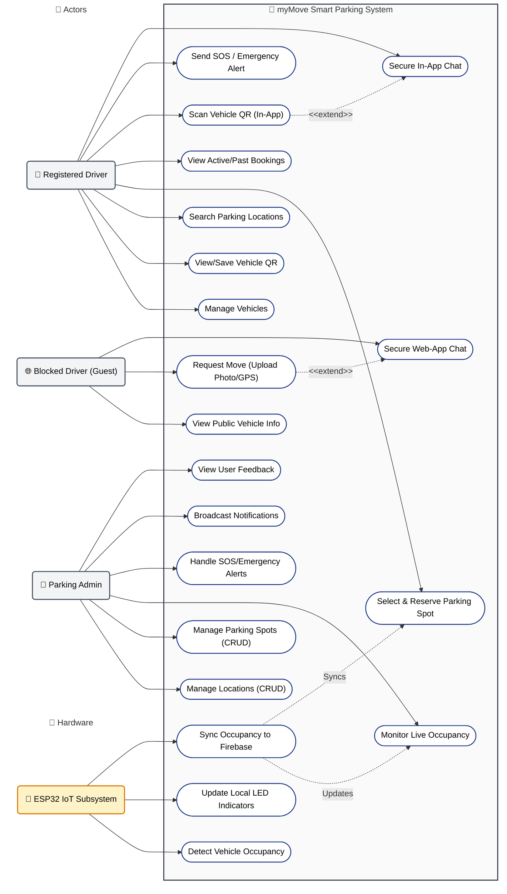

# 📌 Use Case Diagram Specification for myMove

This document details the system use case design for the **myMove** Smart Parking & Communication System. It includes the complete Mermaid diagram code and a step-by-step guide to manually draw it in **draw.io** for academic/thesis documentation, styled to match standard single-boundary vertical use case layouts.

---

## 1. Actors and Their Responsibilities

| Actor Name | Type | Description | Key Responsibilities |
| :--- | :--- | :--- | :--- |
| **Registered User (Driver)** | Human (Primary) | Registered driver using the Flutter mobile app. | Profile & vehicle management, parking search/reservation, scanning QR codes, in-app messaging, triggering SOS alerts. |
| **Blocked Driver (Web Guest)** | Human (Primary) | Temporary web-user who has been blocked by another car. | Scanning a QR code via web browser, uploading proof photo, sharing location, initiating anonymous chat. |
| **Admin / Parking Management** | Human (Primary) | Operator/facility manager using the Web Dashboard. | Location & spot configuration, monitoring live occupancy, managing emergency alerts, broadcasting push notifications, viewing feedback. |
| **ESP32 IoT Subsystem** | System (Supporting) | Hardware controller at the physical parking spots. | Detecting vehicle presence via ultrasonic sensor, updating local LEDs, syncing occupancy to Firebase RTDB. |

---

## 2. Mermaid Diagram (Single System Boundary Layout)

Use the code block below in any Markdown viewer or live editor (e.g., [Mermaid Live Editor](https://mermaid.live)) to generate the diagram. This layout utilizes a single system boundary with vertical stack alignment, matching the classic UML style.

---

## 3. Step-by-Step Guide to Manually Create the Diagram in Draw.io

Follow these instructions to create a clean, professional, publication-grade diagram in **draw.io** (or **diagrams.net**) that matches the single system boundary layout.

### Step 1: Initialize the Environment & Libraries
1. Open [draw.io](https://app.diagrams.net/).
2. On the left sidebar, click **More Shapes** at the bottom.
3. Check the box for **UML** and click **Apply**. This opens the standard UML shapes library.

### Step 2: Draw the Main System Boundary
Use a single **System Boundary** shape (found under the UML section) to containerize the entire platform:
1. Drag a large **System Boundary** rectangle onto the center of the canvas.
2. Double-click the top label to name it: **myMove Smart Parking System**.
3. Style the boundary:
   - Set the background fill to **White** or **Transparent**.
   - Set the border to a solid dark grey line (e.g., `#333333`, stroke width `2px`).

### Step 3: Add the Actors
Place your actors outside the main system boundary box:
1. **Left Side (Human Users)**: Drag **three** **Actor** (Stick Man) shapes from the UML library and stack them vertically:
   - **Registered Driver** (Top-Left)
   - **Blocked Driver (Guest)** (Middle-Left)
   - **Parking Admin** (Bottom-Left)
2. **Right Side (Hardware Subsystem)**: Since the ESP32 is a hardware device/system actor, use a clean rectangle shape:
   - Place a **Rectangle** on the right side of the system boundary.
   - Label it: `«System» \n ESP32 IoT Subsystem`.

### Step 4: Add and Align Use Cases
Inside the system boundary container, drag and drop the **Use Case** (Oval/Ellipse) shapes. Since we have 20 use cases, organize them into **four neat vertical columns** corresponding to each module to keep the layout extremely clean:

1. **Column 1: Mobile App Use Cases** (Align vertically under the Registered Driver):
   - *Manage Vehicles*
   - *View/Save Vehicle QR*
   - *Search Parking Locations*
   - *Select & Reserve Parking Spot*
   - *View Active/Past Bookings*
   - *Scan Vehicle QR (In-App)*
   - *Send SOS / Emergency Alert*
   - *Secure In-App Chat*
2. **Column 2: Web Scanner Use Cases** (Align vertically under the Blocked Driver):
   - *View Public Vehicle Info*
   - *Request Move (Upload Photo/GPS)*
   - *Secure Web-App Chat*
3. **Column 3: Web Admin Use Cases** (Align vertically under the Parking Admin):
   - *Manage Locations (CRUD)*
   - *Manage Parking Spots (CRUD)*
   - *Monitor Live Occupancy*
   - *Handle SOS/Emergency Alerts*
   - *Broadcast Notifications*
   - *View User Feedback*
4. **Column 4: IoT Hardware Use Cases** (Align vertically on the right side next to the ESP32 actor):
   - *Detect Vehicle Occupancy*
   - *Update Local LED Indicators*
   - *Sync Occupancy to Firebase*

### Step 5: Draw Associations (Connectors)
Connect actors to the use cases they trigger:
1. Grab a connector line. To match the requested style, use a **solid line with an arrowhead** pointing at the use case oval.
2. Connect:
   - **Registered Driver** to all 8 Mobile App use cases in Column 1.
   - **Blocked Driver (Guest)** to all 3 Web Scanner use cases in Column 2.
   - **Parking Admin** to all 6 Web Admin use cases in Column 3.
   - **ESP32 IoT Subsystem** to all 3 IoT Hardware use cases in Column 4.

### Step 6: Add Relationships between Use Cases
1. **Extend Relationship**:
   - Draw a **dashed line with a pointing arrowhead** from *Secure In-App Chat* pointing **to** *Scan Vehicle QR (In-App)*. Double-click the line and type `«extend»`.
   - Draw a dashed arrow from *Secure Web-App Chat* pointing **to** *Request Move (Upload Photo/GPS)*, labeled `«extend»`.
2. **Data Flow**:
   - Draw a dashed arrow from *Sync Occupancy to Firebase* pointing **to** *Monitor Live Occupancy* (Web Admin Dashboard) and *Select & Reserve Parking Spot* (Mobile App). Label these `«updates»` or `«syncs»`.

### Step 7: Clean and Format
1. **Alignment**: Highlight the ovals in each column, right-click, and select **Align** -> **Center** to make them perfectly vertical.
2. **Colors**:
   - Use soft blue/grey fills for the ovals.
   - Use a clear sans-serif font (like Arial or Helvetica) with black text for all labels.
3. Export the file as **PNG** or **SVG** to insert directly into your thesis!
